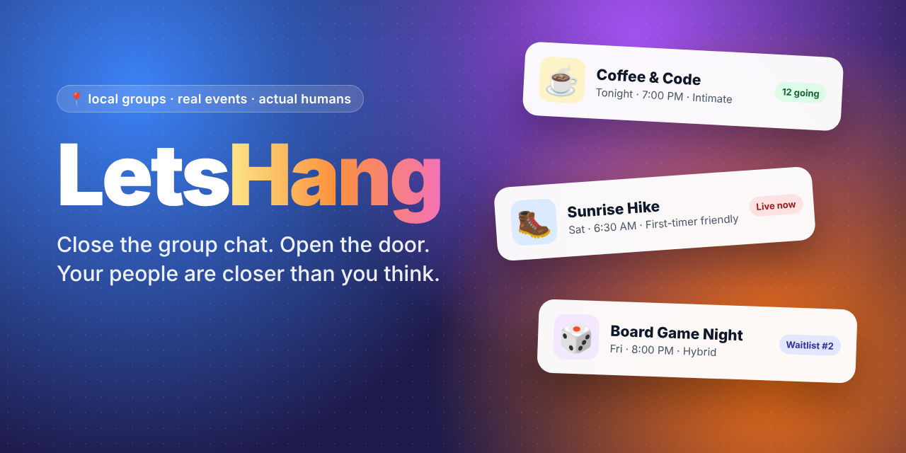
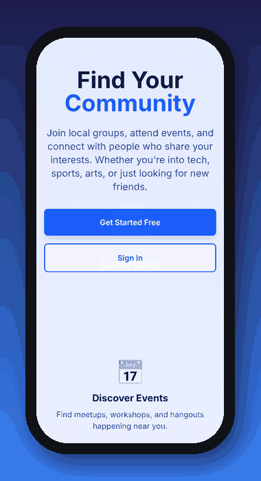
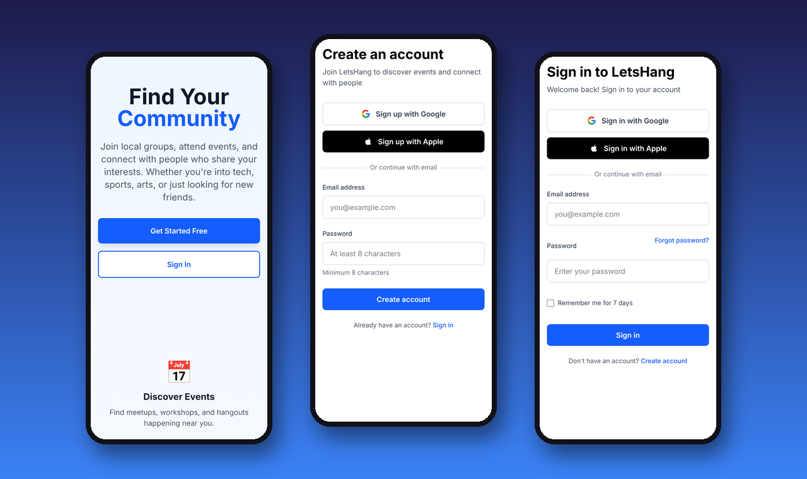

<div align="center">



# LetsHang 🫶

### _Close the group chat. Open the door._

**A mobile-first PWA for finding your people IRL: local groups, real events, actual humans.**


</div>

---

## ✨ The vibe

You know that feeling when you say _"we should totally hang out sometime"_ and then… nobody ever does?

**LetsHang is the "sometime."**

It's the board game night two streets over. The sunrise hike that's _first-timer friendly_, so you don't have to be a trail goblin already. Coffee & Code, Tuesdays at 7. It's the app you open so you can put your phone down and go meet people.

- 🗓️ **Find something to do tonight.** "Happening Now" and "Happening Today" put whatever's on _right now_ near you up front.
- 🫂 **Find your people.** Join groups around what you love, from tech to trail running to tabletop.
- 🎟️ **Show up (or bow out gracefully).** RSVP in one tap, get bumped off the waitlist automatically, and get a friendly day-of _"still coming?"_ ping. No ghosting required.
- 📱 **Pocket-sized.** Install it on your home screen like a native app. It's offline-aware too, so it tells you when the venue's Wi‑Fi is lying to you.

<div align="center">
  
  <br/>
  <sub><i>From "hmm, maybe" to signed up in about ten seconds.</i></sub>
</div>

---

## 📜 A (very) short history of hanging out

Getting together with strangers who share a vibe is one of the oldest things humans do. The tech changes, the itch doesn't.

| Era            | The hangout                                                                                                                                                                                                                             |
| -------------- | --------------------------------------------------------------------------------------------------------------------------------------------------------------------------------------------------------------------------------------- |
| **1650s**      | ☕ England's first coffeehouses open in Oxford and then London. They got nicknamed **"penny universities"**: a penny for a cup of coffee, and you got to argue science, politics and gossip with whoever sat down next to you.          |
| **1600–1700s** | 🕯️ The French **salons**, starting with Madame de Rambouillet's, bring writers, thinkers and the gloriously opinionated together in someone's living room. The original "host an event" feature.                                        |
| **1727**       | 🔧 A 21-year-old **Benjamin Franklin** starts the **Junto**, a weekly club of tradespeople meeting for "mutual improvement." Their habit of pooling books turned into the Library Company of Philadelphia. Peak recurring-event energy. |
| **1989**       | 🏡 Sociologist **Ray Oldenburg** names the **"third place"** in _The Great Good Place_: not home, not work, but the café, pub or barbershop where community actually happens.                                                           |
| **2000**       | 🎳 **Robert Putnam's _Bowling Alone_** sounds the alarm. Americans are joining fewer clubs, leagues and civic groups, and our social capital is quietly draining away.                                                                  |
| **2002**       | 🌐 In the wake of 9/11, when neighbors were talking to each other more than they had in years, **Meetup** launches. The idea is to use the internet to get people _off_ the internet. Online-to-IRL becomes a whole category.           |
| **2023**       | 🩺 The **U.S. Surgeon General** issues an advisory on _Our Epidemic of Loneliness and Isolation_ and treats social connection as a public-health issue, not a nice-to-have.                                                             |
| **Now**        | 🫶 **LetsHang.** The third place is in your pocket, and it nudges you out the door.                                                                                                                                                     |

> The coffeehouse had a penny cover charge. We're free, and the coffee is BYO.

---

## 📸 Screens

<div align="center">
  
</div>

---

## 🧰 What's in the box

<table>
<tr>
<td width="50%" valign="top">

### 🎉 Events

- **In-person, online or hybrid**, with attendance mode per RSVP
- **Capacity + automatic FIFO waitlist**: when someone drops, the next person is promoted
- **Size vibes**: _Intimate_ (&lt;10), _Small_, _Medium_, _Large_. Small isn't lesser, it's cozy.
- **Format & accessibility tags**: workshop, mixer, hangout… plus _first-timer friendly_, _low pressure_, _beginner welcome_
- **Visibility**: public, group-only or hidden
- **Threaded comments** for people who've RSVPed
- **Host check-in**, which opens an hour before start
- **Day-of confirmation pings**: "Still coming?" → ✅ confirm or 🫡 bail out kindly
- **Reminders** 7 days, 2 days and day-of
- **Add to calendar** with RFC 5545 `.ics` export

</td>
<td width="50%" valign="top">

### 🫂 Groups & people

- **Public or private groups** with join requests
- **Roles**: organizer, co-organizer, assistant organizer, member
- **Moderation**: remove, ban and an audit log
- **Profiles** with photo, bio, location and visibility controls
- **Blocking & reporting**, plus messaging rate limits

### 🔎 Discovery

- **Full-text search** with relevance ranking and typo tolerance
- **Quick filters**: Today · Tomorrow · This Weekend · This Week
- **Map view** (Mapbox) and **nearby events**
- **Browse by category**
- **Calendar view** of everything you're into

### 📲 PWA

- Installable app manifest, **offline-aware** UI and local caching helpers, **push notifications** (VAPID)

</td>
</tr>
</table>

---

## 🏗️ Under the hood

```
src/
├── routes/
│   ├── (app)/           # Authenticated: dashboard, events, groups, map, search, calendar…
│   ├── (auth)/          # Login, register, logout, password reset
│   └── auth/callback/   # OAuth / email-verification callback
├── lib/
│   ├── components/      # EventCard, GroupCard, HappeningNow, EventComments…
│   ├── server/          # Server-only logic (comments, reminders, search, blocks…)
│   ├── schemas/         # Zod schemas for every form
│   ├── utils/           # Pure functions: date filters, iCal, geo, reminders…
│   └── types/           # Supabase database types
└── hooks.server.ts      # Per-request Supabase client + session
```

| Layer    | Choice                                                              |
| -------- | ------------------------------------------------------------------- |
| Frontend | SvelteKit · TypeScript (strict) · Tailwind CSS                      |
| Backend  | Supabase: Postgres with Row Level Security, Auth, Realtime, Storage |
| Forms    | Superforms + Zod                                                    |
| Maps     | Mapbox GL                                                           |
| Testing  | Vitest (~2,000 unit tests) · Playwright (E2E)                       |
| Hosting  | Netlify                                                             |

**Security model:** server routes query through the request-scoped Supabase client (`locals.supabase`), which carries the signed-in user's JWT, so Postgres **Row Level Security** decides who sees and changes what. The service-role client is kept for the few trusted operations RLS deliberately forbids, such as promoting _someone else_ off a waitlist.

---

## 🚀 Get it running

```sh
# 1. Install
pnpm install

# 2. Configure (Supabase, Mapbox, VAPID keys)
cp .env.example .env
# …then fill in values from https://supabase.com/dashboard

# 3. Apply the schema
#    supabase/migrations/ holds the canonical consolidated schema

# 4. Hang
pnpm dev   # → http://localhost:5173
```

### Database types

```sh
npm install -g supabase   # one-time
pnpm db:types             # regenerates src/lib/types/database.ts
```

```ts
import type { Tables, TablesInsert, TablesUpdate } from '$lib/types/database';

type User = Tables<'users'>;
type EventInsert = TablesInsert<'events'>;
```

---

## ✅ Quality gates

Nothing merges unless all of these are happy (husky runs them pre-commit):

```sh
pnpm check            # Svelte diagnostics + TypeScript
pnpm lint             # ESLint, 0 errors
pnpm format           # Prettier
pnpm test:coverage    # Vitest, 80% coverage floor
pnpm build            # Production build
pnpm test:e2e         # Playwright
pnpm knip             # Dead code
pnpm depcheck         # Unused dependencies
```

```sh
# The whole gauntlet
pnpm check && pnpm lint && pnpm test:coverage && pnpm build && pnpm knip && pnpm depcheck
```

---

## 📚 More reading

- [`specs/`](specs/readme.md): feature specs, P0 → P2
- [`AGENTS.md`](AGENTS.md): quality-gate thresholds and code patterns
- [`CLAUDE.md`](CLAUDE.md): project guide for AI pair-programmers
- [`IMPLEMENTATION_PLAN.md`](IMPLEMENTATION_PLAN.md): task tracking

---

<div align="center">

**Made for the people who say "we should hang out" and then actually do it.**

MIT © Chris Brooksbank

_Now close this tab and go outside_ 🌤️

</div>
